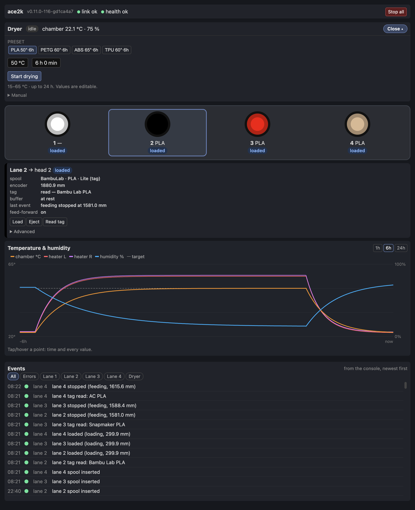

# ace2k-u1

The Snapmaker U1 side of [ace2k](https://github.com/tobecwb/ace2k), the open firmware that makes
the **Anycubic ACE 2 Pro** a native **Klipper** MCU. With this adapter, the unit works with the
U1's own filament flows:

- load and unload;
- the feed at the start of a print, and the unload at the end;
- runout and tangle detection.

Each of the U1's four heads is fed directly by one lane of the unit.

**Status: Release Candidate `v0.3.0-rc.1`.** The long-run print test (burn-in) has not been done
yet.

**The adapter supports exactly one ACE 2 Pro unit.** Lane n feeds head n (extruder n-1): one unit
for the printer's four heads. Support for several units is planned for a later version.

**How this was built.** AI tools were used in developing this firmware. Every feature and every
change was verified on real hardware, over many hours of bench testing, before it was accepted.
Human review of the source code is still in progress.

**A note on the language.** English is not the author's native language, so some terms in this
documentation may read a little oddly. Corrections are welcome.

## Read this first

**Risks.** Flashing third-party firmware onto your ACE 2 Pro carries a small but real risk of
damaging it. What limits that risk:
- ace2k never writes to the bootloader or to the unit's factory calibration pages; it only reads them.
- If a flash is interrupted, the unit's bootloader stays in recovery mode and accepts a new image
  over the same cable (`docs/flashing.md`).
- The heater only runs with both fans on, and it stops if a temperature sensor fails. The unit's
  own 115 °C thermal cutout stays in place.

What remains: the dryer switches mains power. Do not leave a drying cycle unattended. Tested only
at 127 V / 60 Hz; 220–240 V / 50 Hz has never been tried.

(`docs/flashing.md` above is ace2k's:
<https://github.com/tobecwb/ace2k/blob/main/docs/flashing.md>.)

**Disclaimer.** This software is provided "as is", without warranty of any kind (see `LICENSE`).
You use it at your own risk. The author is not responsible for any damage to your unit, your
printer, your filament or anything else that results from installing or running it. Installing it
may void your warranty. This project is not affiliated with or endorsed by Anycubic or Snapmaker.

**Tested on.** One Anycubic ACE 2 Pro unit on a Snapmaker U1 running the paxx extended firmware
`1.6.0-paxx12-22`, at 127 V / 60 Hz. Nothing else has been tested. This is a Release Candidate: the
long-run print test (burn-in) has not been done yet.

> [!WARNING]
> **Do not leave a drying cycle unattended.** The dryer switches mains power to a heater. It has
> been tested only by the author, for at most four hours of continuous drying, and only at
> 127 V / 60 Hz. On 220–240 V / 50 Hz mains nobody has run it yet: if that is your mains, expect
> to be the first.
>
> The firmware has its own protections: the heater runs only with both fans on, it stops at 85 °C
> at the outlets and when the chamber goes past its limit (the target + 10 °C, or 80 °C), and a
> lost sensor, lost mains or stopped fans end the cycle. These protections are covered by
> automated tests, but they were **not provoked on a real unit**: doing so could damage it, and
> the units are few and, where the author lives, very expensive. Below the firmware, the unit's
> own 115 °C thermal cutout remains as a last, hardware protection.

## What it does

- `klippy/extras/ace2k_u1.py`: the `[ace2k_u1]` section. It attaches at run time to the U1's own
  side-feeder module (`filament_feed`), so the U1's flows drive the unit. No file of the printer
  is replaced.
- `klippy/extras/ace2k_u1_tags.py`: sets each head's filament setting on the U1 from the spool's
  tag.
- `klippy/extras/ace2k_u1_history.py` and `web/`: the web page `http://<printer>/ace2k/`.
- `config/ace2k-u1.cfg`: the adapter's section.

The adapter adds two G-code commands, `ACE_EJECT` and `ACE_ADAPTER_STATUS`
([`docs/commands.md`](docs/commands.md)). Everything else is ace2k's own.

**Spool tags.** A spool from Anycubic, Bambu Lab or Snapmaker carries an RFID tag. The unit reads
it while it loads the filament. The adapter then sets that head's filament setting on the U1 from
the tag: vendor, type, subtype and colour, as the U1's screen shows them. When the spool leaves the
bay, the head goes back to unknown, as the U1 does for any spool. To turn this off, set
`apply_tags: False` in `[ace2k_u1]`. Loading and feeding are not affected. Details:
[How a spool's tag sets the head's filament](docs/install.md#how-a-spools-tag-sets-the-heads-filament).

Those three brands are what ace2k decodes today. They are not a limit. In principle, any brand
works whose tag layout is known (and, for a MIFARE tag, its key or how to derive it). A brand is
added on the host as a small decoder, with no firmware change and no reflash (ace2k's
[README](https://github.com/tobecwb/ace2k#readme), "Spool tags from almost any brand"). The U1
keeps its own list of vendors and types. A vendor it does not know is shown with the name the tag
gives. For that type, the U1 then uses its generic settings (for example, its generic PLA
temperatures).

## The web page

Open `http://<printer>/ace2k/` in a browser on the same network as the U1. `<printer>` is the
U1's address, the same one you use for its own web interface. The page shows:

- the unit's four bays, with their spools' colours;
- each lane's state and actions (load, eject, stop, clear, feed and roll back, read the tag, edit
  the spool);
- the dryer, with its presets;
- a chart of the chamber's temperature and humidity, and of the heater outlets;
- the unit's events.

It sends the same G-codes as the console, and it works on a phone too. Setup and details:
[The web page](docs/install.md#the-web-page). Every action is listed in
[`docs/commands.md`](docs/commands.md).

## Requirements

- A Snapmaker U1 with the paxx extended firmware `v1.6.0-paxx12-22`.
- ace2k `v0.12.0-rc.1`, on the unit **and** on the printer (its host side). Its host interface
  must be at `API_VERSION` 6 or later. The adapter does not hook on anything older.
- One ACE 2 Pro unit, its USB adapter plugged into the printer.

## Documentation

- [`docs/install.md`](docs/install.md): what the adapter does, how to install it (ace2k first,
  then the adapter), and how to use it (tags, runout and lane errors, eject, the web page,
  troubleshooting).
- [`docs/configuration.md`](docs/configuration.md): every setting of `ace2k-u1.cfg`, with its
  default and range.
- [`docs/commands.md`](docs/commands.md): `ACE_EJECT`, `ACE_ADAPTER_STATUS`, `ACE_CLEAR`, the
  macros of `config/ace2k-u1.cfg` and the web page.
- [ace2k](https://github.com/tobecwb/ace2k): the firmware and its own documentation.

## Credits

Built on the published work of **[hakimio](https://github.com/hakimio)** (the ACE 2 Pro
protocol) and **[Simon-CR](https://github.com/Simon-CR)** (the reader protocol and spool-rotation
concepts), among others. See ace2k's
[`docs/credits.md`](https://github.com/tobecwb/ace2k/blob/main/docs/credits.md). The U1 itself and
the extended firmware it runs are Snapmaker's and paxx's.

## License

GPL-3.0 (see `LICENSE`).
